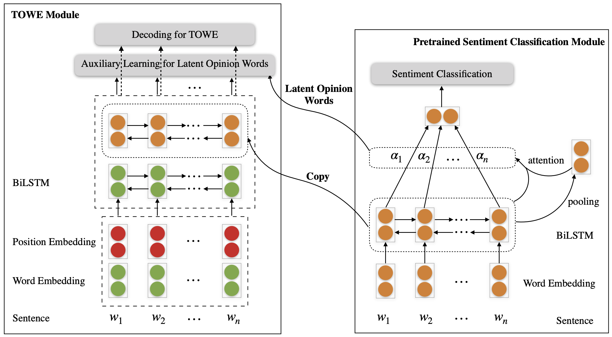

# LOTN

Code and data for "[Latent Opinions Transfer Network for Target-Oriented Opinion Words Extraction](https://arxiv.org/pdf/2001.01989.pdf)" (AAAI 2020)

## Overview



- In tackling the problem of insufficient annotated data, we are the first to propose transferring latent opinion knowledge from resource-rich review sentiment classification datasets to the low-resource task of TOWE.
- To transfer opinion information effectively, we propose a Latent Opinions Transfer Network (LOTN) model that obtains latent opinion words from a sentiment classification model and integrates them into TOWE via an auxiliary learning signal.

## Dependencies

- python=3.5
- numpy=1.14.2
- tensorflow==1.9

## Quick Start

### Step1: pretrained
```bash
sh run_pre_trained.sh
```
### step2: transfer
- Softmax
```bash
sh run_LOTN.sh
python eval_LOTN.py
```
- CRF
```bash
sh run_LOTN.sh
python eval_LOTN_crf.py
```
## Citation
```bash
@inproceedings{DBLP:conf/aaai/WuZDHC20,
  author    = {Zhen Wu and Fei Zhao and Xin{-}Yu Dai and Shujian Huang and Jiajun Chen},
  title     = {Latent Opinions Transfer Network for Target-Oriented Opinion Words Extraction},
  booktitle = {The Thirty-Fourth {AAAI} Conference on Artificial Intelligence, {AAAI} 2020, New York, NY, USA, February 7-12, 2020},
  pages     = {9298--9305},
  year      = {2020}
}
```

if you have any questions, please contact me zhaof@smail.nju.edu.cn.